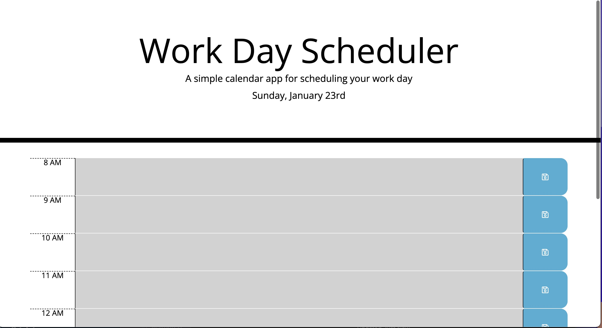
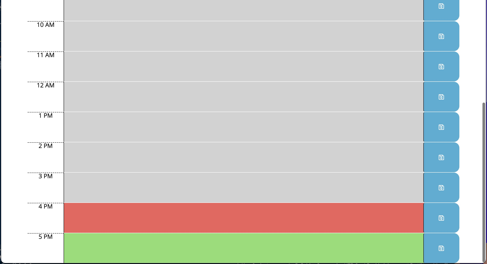

# 05 Third-Party APIs: Work Day Scheduler

Create a simple calendar application that allows the user to save events for each hour of the day. This app will run in the browser and feature dynamically updated HTML and CSS powered by jQuery.

This application lets you save work day tasks locally and is color coordinated to help you keep track of which tasks are past, present, and due in the future.

